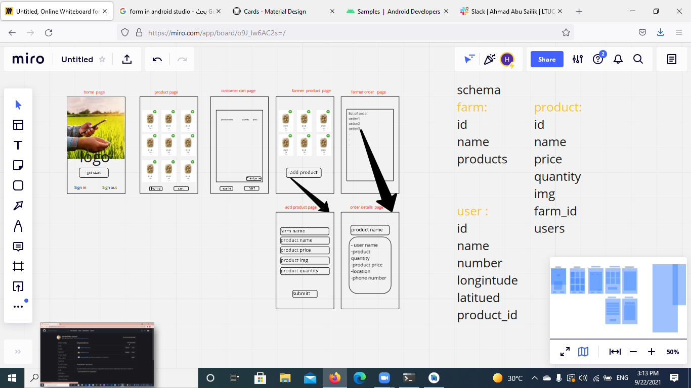

# Farm-App

# team member 
1. sanabel abu-ezbead
2. ahmad abu sailik
3. aya abu dagar
4. haneen bader
5. osama alali

# wire-fram and schema

# Cooperation Plan
What are the key strengths of each person on the team? 
1. sanabel abu-ezbead       . css and functionality  
2. ahmad abu sailik         . problem solving and functionality 
3. aya abu dagar            . css and functionality
4. haneen bader             . seraching resorses
5. osama alali              . css and functionality 

How can you best utilize these strengths in the execution of your project?  
we will uses these strengths and distripute them in best way to make agood project 

Knowing that every person in your team needs to understand all aspects of the project, how do you plan to approach the day-to-day work?
we will work in groubs and after that we will make meeting to communicate with each other to disscus what all groubs are worked and expaln every things 

# Conflict Plan
What will be your group’s process to resolve conflict, when it arises? 
before the conflict happen we will make for everyone of out team branch and when we make push and merge we will communicate with others to help other and solve any problems if happen any things 

What will your team do if one person is taking over the project and not letting the other members contribute?
we will distrubte the work betwen each other to all members work 

How will you approach each other and the challenges of the project knowing that it is impossible for all members to be at the exact same place in understanding and skill level?
we will work on paris but we will disscuss all work between each other 

# Communication Plan
What hours will you be available to communicate? from 9 AM-10 PM
What platforms will you use to communicate (ie. Slack, phone …)? Slack and zoom
How often will you take breaks? 2 time
What is your plan if you start to fall behind? we will extend the hour work
How will you communicate after hours and on the weekend? slack and WhatsApp
How will you ensure that you are creating a safe environment where everyone feels comfortable speaking up? we will work together as a pair

# Work Plan
How you will identify tasks, assign tasks, know when they are complete, and manage work in general? To-do lists are classic, yet powerful and effective more than ever today. Back in the day, people kept handwritten notes for ideas and things to get done. They are like your everyday essentials and add to your effective task management tips.
 What project management tool will be used? Using Github, Trello

# problem domain
we didnt have connect the famrer and users so we make plattform that is allow the useres his connect to the famrs and seclect what they needs 